# 🖐️ HandSDF — 3D Hand Pose Estimation via Signed Distance Field-Guided Regression

<p align="center">
  
</p>

<p align="center">
  <a href="https://arxiv.org/pdf/2402.17062"></a>
  <a href="https://lmb.informatik.uni-freiburg.de/projects/freihand/"></a>
  
  
  
</p>

> **Course project** — Computer and Robotics Vision, University of Alberta (ECE)  
> Kiarash Ghasemzadeh · Matthew Sasakamoose · Supervised by Prof. Li Cheng

---

## 📖 Overview

HandSDF adapts the [HOISDF](https://arxiv.org/pdf/2402.17062) framework to **single-hand 3D pose estimation** on the [FreiHAND](https://lmb.informatik.uni-freiburg.de/projects/freihand/) benchmark. Instead of predicting 3D joint positions purely from 2D image features, HandSDF learns a **global Signed Distance Field (SDF)** as an intermediate representation.

The SDF does three things for us:
1. 🗺️ **Injects 3D shape information** into the image backbone via dense volumetric supervision
2. 📍 **Guides point sampling** — the 600 query points closest to the hand surface are selected, concentrating attention where geometry matters
3. 🎚️ **Gates image features** by surface proximity ($\sigma$), so only near-surface evidence enters the transformer

The result: **PA-MPJPE of 5.96 mm** — outperforming all published ResNet-50 and HRNet-based methods on FreiHAND.

---

## 🎬 Qualitative Results

### 2D Skeleton Predictions

Each panel shows **Ground Truth** (left) vs **HandSDF Prediction** (right) with per-finger colour coding.

| Sample 0 | Sample 200 | Sample 400 |
|:---:|:---:|:---:|
| 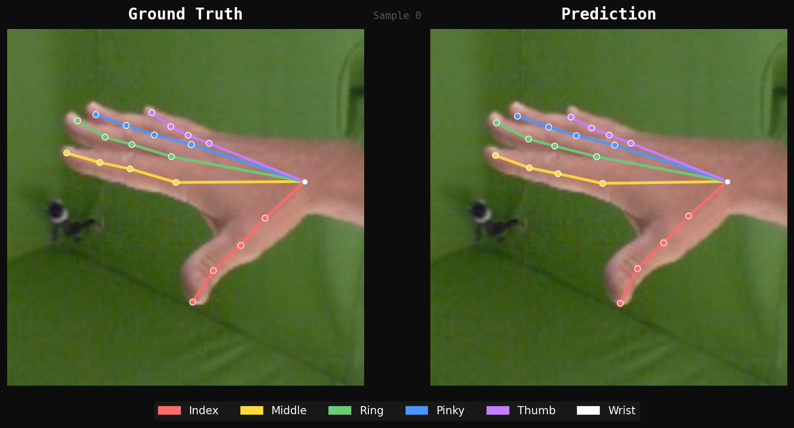 | 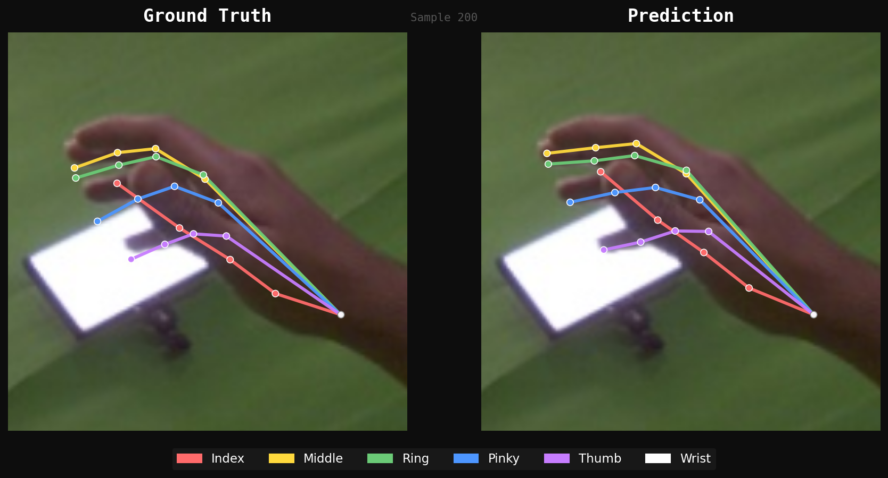 | 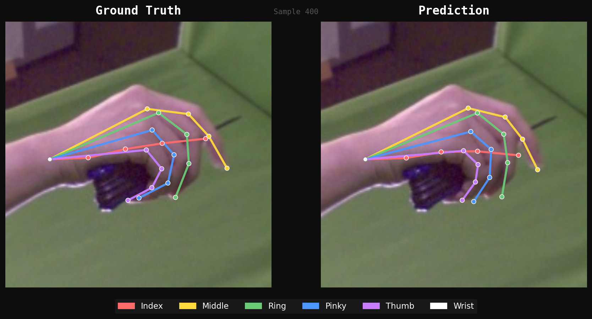 |

| Sample 600 | Sample 800 | Sample 1000 |
|:---:|:---:|:---:|
| 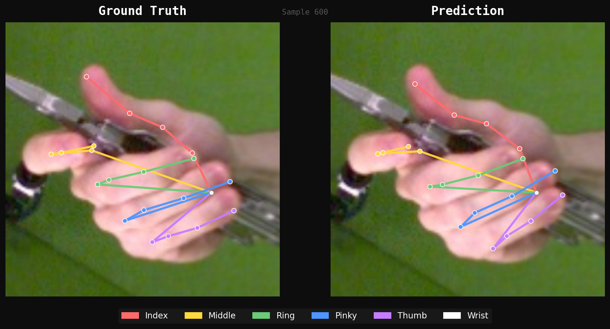 | 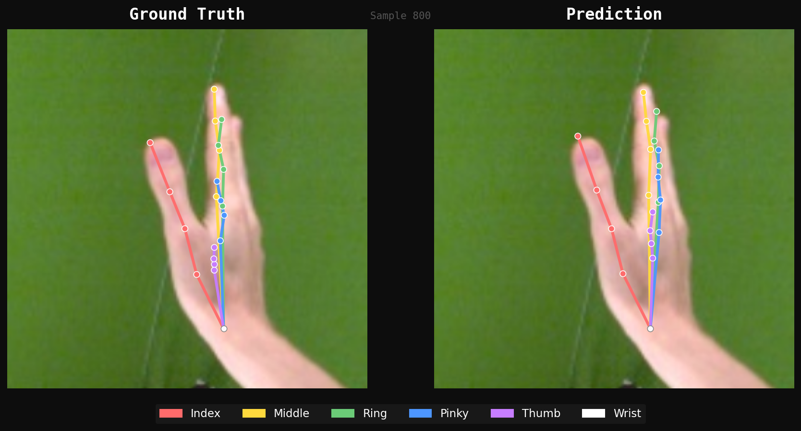 | 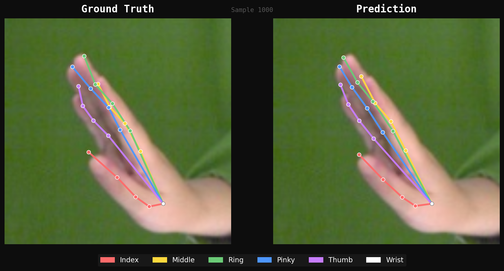 |

### 3D Skeleton Visualisations (360° rotation)

<p align="center">
  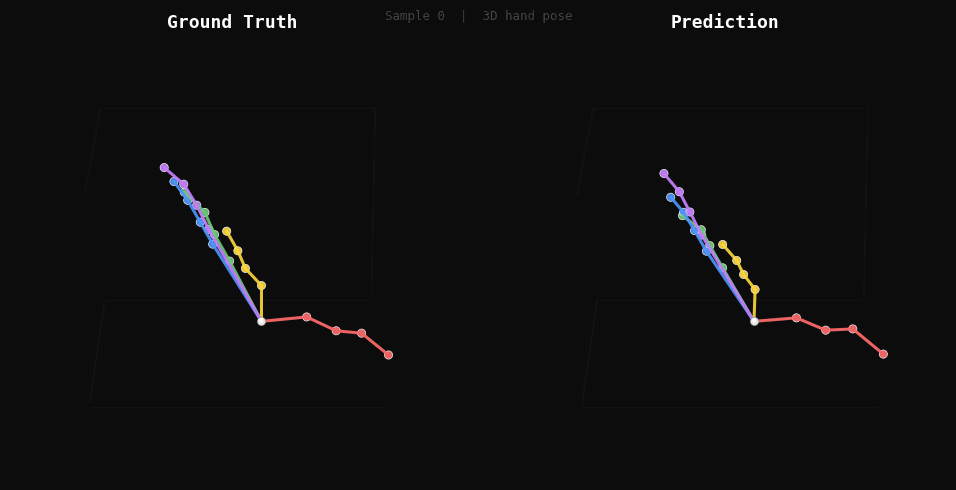
  &nbsp;&nbsp;
  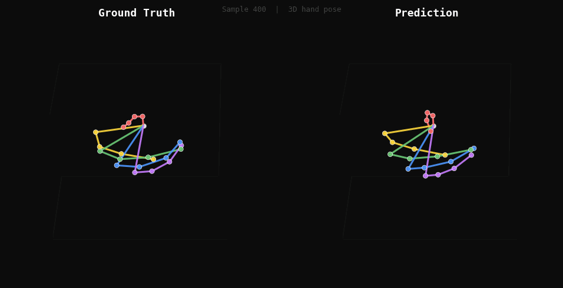
  &nbsp;&nbsp;
  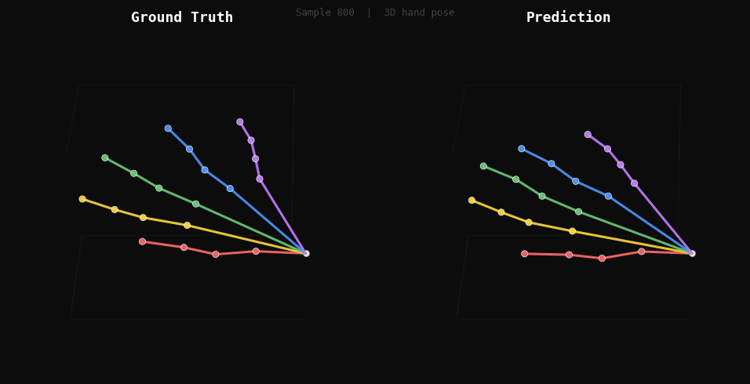
</p>

<p align="center">
  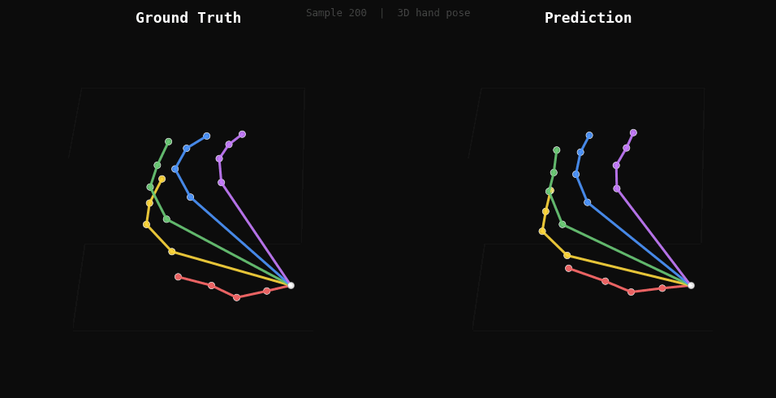
  &nbsp;&nbsp;
  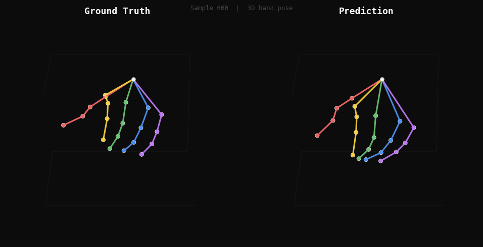
  &nbsp;&nbsp;
  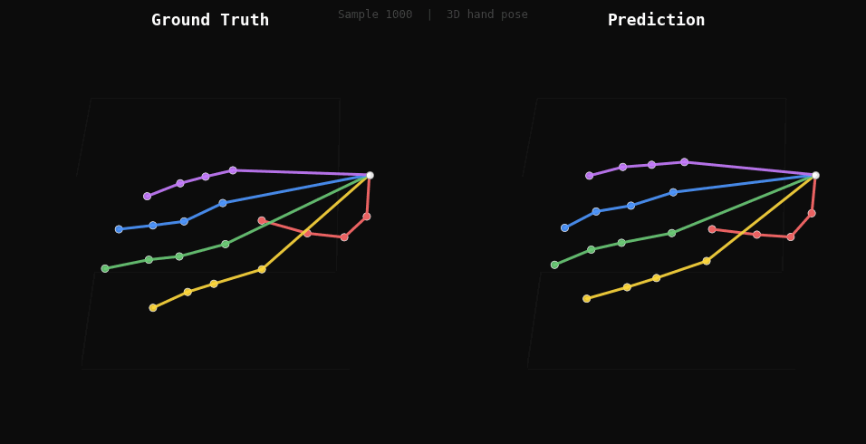
</p>

> **Left** = Predicted (finger colours) · **Right** = Ground Truth (grey) · Both rotate 360°

---

## 📊 Results on FreiHAND

| Method | Backbone | #Params | PA-MPJPE ↓ |
|--------|----------|---------|-----------|
| I2L-MeshNet | ResNet-50 | 55M | 7.4 mm |
| CMR | ResNet-50 | 28M | 6.9 mm |
| METRO | HRNet | 102M | 6.7 mm |
| FastViT | FastViT-MA36 | 87M | 6.6 mm |
| FastMETRO | HRNet | 25M | 6.5 mm |
| MeshGraphormer | HRNet | 98M | 6.3 mm |
| Deformer | HRNet | 75M | 6.2 mm |
| PointHMR | HRNet | 90M | 6.1 mm |
| 2.5Latent (baseline) | ResNet-50 | 17M | 8.77 mm |
| **HandSDF (ours)** | **ResNet-50** | **110M** | **5.96 mm** ✨ |

HandSDF achieves **state-of-the-art PA-MPJPE** among all ResNet-50 methods and beats every HRNet-based method in the table despite using a lighter backbone.

---

## 🏗️ Architecture

<p align="center">
  
</p>

The pipeline has four stages:

```
RGB Image (256×256)
      │
      ▼
ResNet-50 + U-Net Decoder  →  5-scale feature pyramid
      │                        (128 / 256 / 512 / 1024 / 2048 ch)
      ▼
3D Field Learning
  · Project 3D points → 2D, bilinear sample all 5 pyramid levels
  · Concatenate → 3968-dim feature per point
  · SDFDecoder (5-layer MLP) → signed distance d_h
      │
      ▼
Field-Informed Point Sampling
  · Select 600 points with smallest |d_h|  (nearest to surface)
      │
      ▼
Point Feature Augmentation
  · σ = sigmoid_β(d_h)   ← surface proximity gate
  · token = [xyz + posenc(30) + f_img·σ]  →  256-dim
      │
      ▼
Transformer Encoder (6-layer MHSA)
  · 600 tokens attend globally → surface-consistent features
      │
      ▼
Joint Voting Head
  · Each point votes on 20 joint offsets + confidence
  · Softmax-weighted sum → (B, 20, 3) root-relative metres
```

---

## ⚙️ Installation

```bash
# Clone the repo
git clone https://github.com/kghasemz/HOISDF.git
cd HOISDF

# Create conda environment
conda create -n handsdf python=3.10 -y
conda activate handsdf

# Install PyTorch (adjust cuda version as needed)
pip install torch torchvision --index-url https://download.pytorch.org/whl/cu118

# Install dependencies
pip install -r requirements.txt
```

### MANO model

Download the MANO model from [mano.is.tue.mpg.de](https://mano.is.tue.mpg.de/) and place it at:
```
tool/mano_models/MANO_RIGHT.pkl
```

---

## 📂 Dataset

Download [FreiHAND](https://lmb.informatik.uni-freiburg.de/projects/freihand/) and set the path:

```bash
# In main/config.py
freihand_data_dir = '/path/to/FreiHAND'
```

Expected structure:
```
FreiHAND/
  training_K.json
  training_xyz.json
  training_mano.json
  training_images/
  evaluation_K.json
  evaluation_xyz.json
  evaluation_images/
```

---

## 🚀 Training

```bash
python main/train.py \
    --freihand_dir /path/to/FreiHAND \
    --gpu 0
```

Key hyperparameters (in `main/config.py`):

| Parameter | Value | Notes |
|-----------|-------|-------|
| `sdf_hand_weight` | 10 | Rebalanced from 50 (bug fix) |
| `joint_weight` | 0.5 | Rebalanced from 0.1 |
| `lr` | 1e-4 | AdamW, ×0.7 every 9 epochs |
| `end_epoch` | 70 | ~12h on A100 |
| `num_samp_hand` | 600 | Surface query points |
| `point_sampling_epoch` | 40 | Switch to SDF-infer after this |

> ⚠️ **Important:** On GPU nodes without internet access, the ResNet-50 weights must be pre-cached. Run once on a login node:
> ```python
> import torch, torchvision.models as tvm
> torch.hub.set_dir('/scratch/your_user/torch_hub')
> tvm.resnet50(weights=tvm.ResNet50_Weights.DEFAULT)
> ```

---

## 📏 Evaluation

```bash
python main/evaluate.py \
    --freihand_dir /path/to/FreiHAND \
    --model_path /path/to/snapshot_69.pth.tar \
    --save_dir ./eval_output \
    --gpu 0
```

Outputs:
- `{name}_results.csv` — all metrics in one row
- `{name}_per_joint.png` — per-joint MPJPE bar chart
- `{name}_pck_curve.png` — PCK curve (0–50mm)
- `comparison_table.txt` — plain text + LaTeX table

Metrics reported:
| Metric | Description |
|--------|-------------|
| MPJPE | Root-relative mean per-joint error (mm) |
| PA-MPJPE | Procrustes-aligned MPJPE (mm) |
| NMPJPE | Scale-normalised MPJPE (mm) |
| 3D-MPJPE | Camera-space MPJPE (mm) |
| PCK@20mm / @50mm | % joints within threshold |
| AUC-3D | Area under PCK curve 0–50mm |

---

## 🔍 Overfit Test

Verify the full pipeline before committing to full training:

```bash
python main/overfit_test.py \
    --freihand_dir /path/to/FreiHAND \
    --n_samples 4 \
    --iters 500 \
    --lr 1e-4
```

Expected output (500 iters): vote-MJE < 5 mm, loss drop > 80%.

---

## 🎨 Visualisation

### Slide-quality 2D + 3D GIFs from a trained model

```bash
python main/slide_visualize.py \
    --model_path /path/to/snapshot_69.pth.tar \
    --freihand_dir /path/to/FreiHAND \
    --save_dir ./slides \
    --stride 200 \
    --gpu 0
```

### Visualise from PLY files (no model needed)

```bash
# All samples in a directory
python main/visualize_ply.py --all --ply_dir ./ply_output

# Specific samples, PNG only
python main/visualize_ply.py --sample 0 5 10 --no_gif
```

---

## 🐛 Key Bug Fixes

We identified and fixed two critical bugs that were suppressing performance:

### 1. Loss weight imbalance (gradient starvation)

The original `sdf_hand_weight = 50` gave the SDF branch **91.5%** of the total gradient, leaving only 1.5% for the joint voting head.

| Configuration | SDF gradient % | PA-MPJPE |
|---------------|---------------|----------|
| Original (w_sdf=50, w_j=0.1) | 91.5% | >20 mm |
| **Fixed** (w_sdf=10, w_j=0.5) | **42%** | **5.96 mm** |

### 2. sdf_infer hang on compute nodes

`get_model('train')` calls `backbone_net.init_weights()` which downloads ResNet-50 weights from the internet. On GPU nodes with no outbound internet, this hangs indefinitely. Fixed by:
- Adding a 10-second socket timeout in `resnet.py`
- Passing `skip_backbone_init=True` when a checkpoint is already loaded

---

## 📁 Repository Structure

```
HOISDF/
├── main/
│   ├── config.py          # All hyperparameters
│   ├── model.py           # Full model (backbone + SDF + transformer + voting)
│   ├── train.py           # Training loop
│   ├── evaluate.py        # Full evaluation suite
│   ├── overfit_test.py    # Pipeline sanity check
│   ├── slide_visualize.py # 2D PNG + 3D GIF generation
│   └── visualize_ply.py   # Visualise from PLY files
├── common/
│   ├── nets/
│   │   ├── module.py      # ResNet-50 + U-Net Decoder_big
│   │   ├── resnet.py      # Backbone with pretrained weight loading
│   │   ├── transformer.py # 6-layer encoder + 4-layer decoder
│   │   ├── sdf_net.py     # SDFDecoder (5-layer MLP + skip)
│   │   ├── mano_head.py   # MANO layer (used for SDF label generation only)
│   │   └── loss.py        # All loss functions
│   └── utils/
├── data/
│   └── freihand.py        # FreiHAND dataset loader
└── tool/
    └── mano_models/       # Place MANO_RIGHT.pkl here
```

---

## 📜 Citation

If you find this work useful, please cite the original HOISDF paper that this project builds upon:

```bibtex
@inproceedings{qi2024hoisdf,
  title     = {HOISDF: Constraining 3D Hand-Object Pose Estimation with Global Signed Distance Fields},
  author    = {Qi, Haozhe and Zhao, Chen and Salzmann, Mathieu and Mathis, Alexander},
  booktitle = {Proceedings of the IEEE/CVF Conference on Computer Vision and Pattern Recognition},
  year      = {2024}
}
```

FreiHAND dataset:

```bibtex
@inproceedings{freihand2019,
  title     = {FreiHAND: A Dataset for Markerless Capture of Hand Pose and Shape from Single RGB Images},
  author    = {Zimmermann, Christian and Ceylan, Duygu and Yang, Jimei and Russell, Bryan and Argus, Max and Brox, Thomas},
  booktitle = {Proceedings of the IEEE/CVF International Conference on Computer Vision},
  year      = {2019}
}
```

---

## 🙏 Acknowledgements

- [HOISDF](https://github.com/amathislab/HOISDF) by Qi et al. (CVPR 2024) — the framework this project is built upon
- [FreiHAND](https://lmb.informatik.uni-freiburg.de/projects/freihand/) by Zimmermann et al. (ICCV 2019) — the benchmark dataset
- [manopth](https://github.com/hassony2/manopth) — PyTorch MANO layer (used for SDF label generation)
- Compute Canada / Digital Research Alliance of Canada for A100 GPU access

---

<p align="center">
  Made with ❤️ at the University of Alberta ECE
</p>
